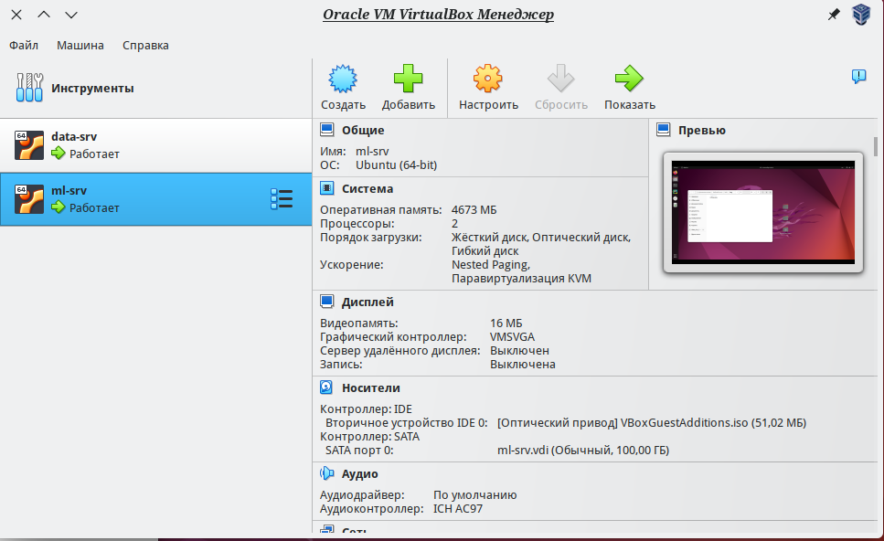
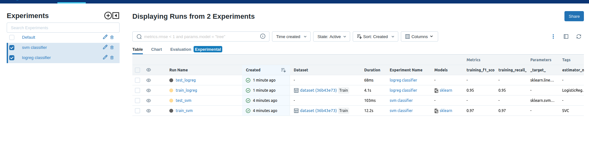

# lab1

Лабораторная работа №1 - создание конвейера машинного обучения с помощью инструментов DVC и MLFlow
Автор: Русинова Залина

## Эксперименты

В проекте реализованы следующие эксперименты

| № | Название ветки git | Параметры эксперимента                           |
|---|--------------------|--------------------------------------------------|
| 1 | logreg-classifier  | Модель - sklearn.linear_model.LogisticRegression |
| 2 | svm_classifier     | Модель - sklearn.svm.SVC                                        |


## Настройка среды

Чтобы воспроизвести эксперименты, требуется выполнить следующие шаги:

1. На первом этапе настроить ВМ для хранения данных и проведения экспериментов с помощью Virtual Box:

<p align="center">
  
</p>

2. На ВМ ml-srv склонировать код из этого репозитория. Настроить виртуальное окружение 
```
python3 -m venv env
```
и установить зависимости
```
python3 -m pip install -r requirements.txt
```
3. Запустить mlflow с помощью команды 
```
mlflow ui
```
4. Перейти в ветку нужного эксперимента, проверить настройки в файле `.dvc/config` и воспроизвести эксперимент командой `dvc repro`
5. Результаты эксперимента отслеживаются с помощью mlflow. MlflowUI можно найти по адресу: `https://127.0.0.1:5000`

